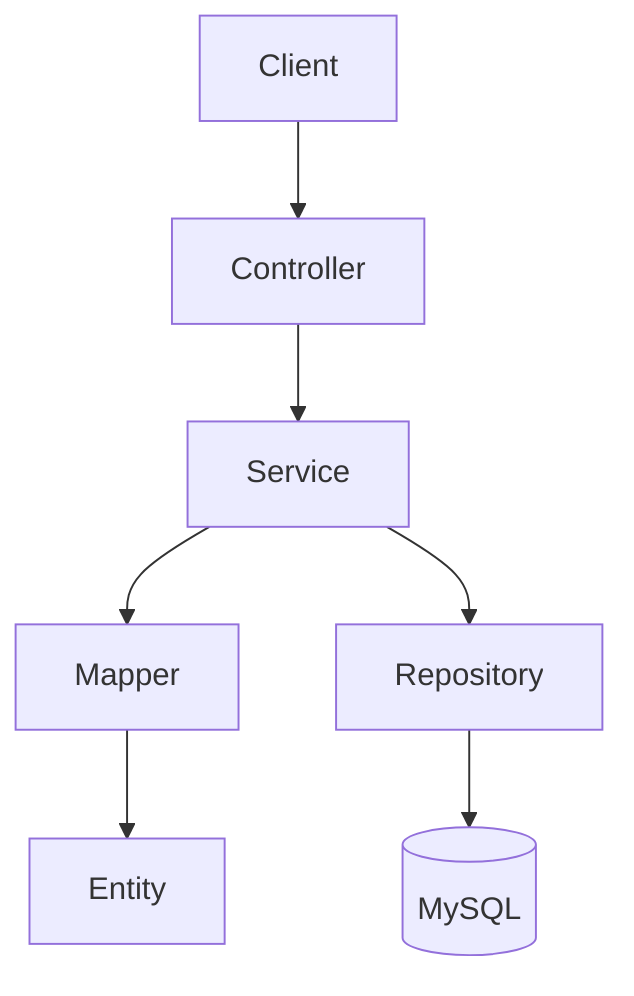

<div align="center">

# 🧾 Invora

### Modern Open-Source Invoice Management System

Invora helps businesses manage customers, products, invoices, payments, currencies, and company information from one platform.

[](https://www.oracle.com/java/)
[](https://spring.io/projects/spring-boot)
[](https://maven.apache.org/)
[](#-project-status)

</div>

---

## 📖 Overview

Invora is a Java and Spring Boot backend for freelancers, startups, and small to medium-sized businesses. It provides a structured way to create invoices, record payments, manage business records, and calculate outstanding balances.

The project focuses on clean code, reliable financial calculations, maintainable architecture, and support for Zimbabwean business requirements.

## ✨ Features

### Core Business Features

- 👥 Customer creation, updates, search, and duplicate validation
- 📦 Product catalogue, pricing, categories, and stock management
- 🧾 Invoice creation, issuing, cancellation, and status management
- 🧮 Automatic subtotal, discount, tax, total, and balance calculations
- 💳 Payment recording, updates, history, and invoice balance recalculation
- 💱 Multi-currency management with a configurable default currency
- 🏢 Company profile, tax, contact, and banking information
- 📝 Audit records for business activity
- 🛡️ Centralised validation and API exception handling

### Platform Features

- 🔐 JWT authentication and role-based access control
- 📚 Swagger/OpenAPI documentation
- 🐳 Docker-based application and database setup
- 🇿🇼 ZIMRA fiscalisation and tax integration
- 📄 Invoice PDF generation
- ✉️ Invoice delivery by email
- 📊 Business reports and analytics

## 🚦 Project Status

Invora is actively developed. Its core domain model and major business services are implemented, while the API and integration layers are being expanded.

| Area | Status |
| --- | --- |
| Entities, DTOs, repositories, and mappers | ✅ Implemented |
| Customer, product, currency, invoice, payment, and company services | ✅ Implemented |
| Invoice calculations and business rules | ✅ Implemented |
| Global exception handling | ✅ Implemented |
| REST controllers | 🚧 In development |
| JWT security | 🚧 In development |
| Swagger/OpenAPI | 🚧 In development |
| Docker | 🚧 In development |
| ZIMRA integration | 🚧 In development |
| PDF, email, and reports | 🚧 In development |

## 🧰 Technology Stack

| Area | Technology |
| --- | --- |
| Language | Java 21 |
| Framework | Spring Boot 4.1.0 |
| Web | Spring Web MVC |
| Persistence | Spring Data JPA and Hibernate |
| Database | MySQL |
| Mapping | MapStruct 1.6.3 |
| Validation | Jakarta Bean Validation |
| Security | Spring Security and JWT |
| Documentation | Swagger/OpenAPI |
| Containerisation | Docker |
| Build | Maven |

## 🏗️ Architecture

Invora follows a layered architecture:



- **Controllers** handle HTTP requests and responses.
- **Services** contain workflows and business rules.
- **Repositories** manage database access.
- **DTOs** define validated requests and safe responses.
- **Mappers** convert between DTOs and entities.
- **Exceptions** provide consistent API errors.

## 📁 Project Structure

```text
src/main/java/
├── controller/        # REST controllers
├── dto/               # Request and response records
├── entity/            # JPA entities
├── enums/             # Domain status values
├── exception/         # Custom exceptions and error handling
├── mapper/            # MapStruct mappings
├── repository/        # Spring Data repositories
├── service/           # Service contracts
└── service/impl/      # Business logic
```

## 🚀 Getting Started

### Requirements

- JDK 21
- Maven 3.9+
- MySQL 8+
- Git

### 1. Clone the Repository

```bash
git clone https://github.com/ezra-kutsvaira/Invora.git
cd Invora
```

### 2. Create the Database

```sql
CREATE DATABASE invora_db;
```

### 3. Configure the Application

Add the database settings to `src/main/resources/application.properties`:

```properties
spring.application.name=invoice-maker

spring.datasource.url=${DATABASE_URL:jdbc:mysql://localhost:3306/invora_db}
spring.datasource.username=${DATABASE_USERNAME:root}
spring.datasource.password=${DATABASE_PASSWORD}

spring.jpa.hibernate.ddl-auto=update
spring.jpa.open-in-view=false
```

Set `DATABASE_PASSWORD` locally. Never commit credentials.

### 4. Run Invora

```bash
mvn spring-boot:run
```

## 🧪 Build and Test

```bash
# Build the project
mvn clean package

# Run the tests
mvn test

# Run all verification checks
mvn verify
```

## 📚 API Documentation

Swagger UI provides interactive documentation for Invora's REST API:

```text
http://localhost:8080/swagger-ui/index.html
```

The OpenAPI specification is exposed at:

```text
http://localhost:8080/v3/api-docs
```

These endpoints become available when the Swagger/OpenAPI integration is enabled.

## 🔐 Security

Invora uses Spring Security as its security foundation. JWT authentication provides stateless user sessions, while role-based access control protects business operations.

Security includes:

- Password hashing
- JWT validation
- Role-based permissions
- Request validation
- Centralised error handling
- Environment-based secret configuration

## 🐳 Docker

Docker provides a consistent environment for Invora and MySQL. The container setup supports local development without requiring a separately installed database.

The Docker configuration is maintained alongside the application as the deployment layer is completed.

## 🇿🇼 ZIMRA Integration

Invora includes ZIMRA fiscalisation in its product scope to support Zimbabwean tax requirements. The integration covers fiscal invoice submission, tax data exchange, receipt verification, and compliant invoice records.

ZIMRA credentials and API settings must be supplied securely through environment variables.

## 🌿 Git Workflow

```text
main          Stable code
development   Integration branch
feature/*     Feature development
fix/*         Bug fixes
docs/*        Documentation
```

Create work from `development` and open a pull request back into `development`.

## 🤝 Contributing

1. Fork the repository.
2. Create a feature branch.
3. Make and test your changes.
4. Run `mvn verify`.
5. Push the branch.
6. Open a pull request into `development`.

Follow the existing naming conventions, use constructor injection, keep business logic in services, and never commit credentials.

## 📄 License

Invora is prepared for release under the MIT License. A `LICENSE` file will define the final distribution terms.

## 👨‍💻 Author

**Ezra Kutsvaira**  
Java Backend Developer focused on Spring Boot, fintech, and business systems.

[GitHub](https://github.com/ezra-kutsvaira)

---

<div align="center">

### ⭐ Support Invora

Star the repository, report an issue, or contribute an improvement.

</div>
