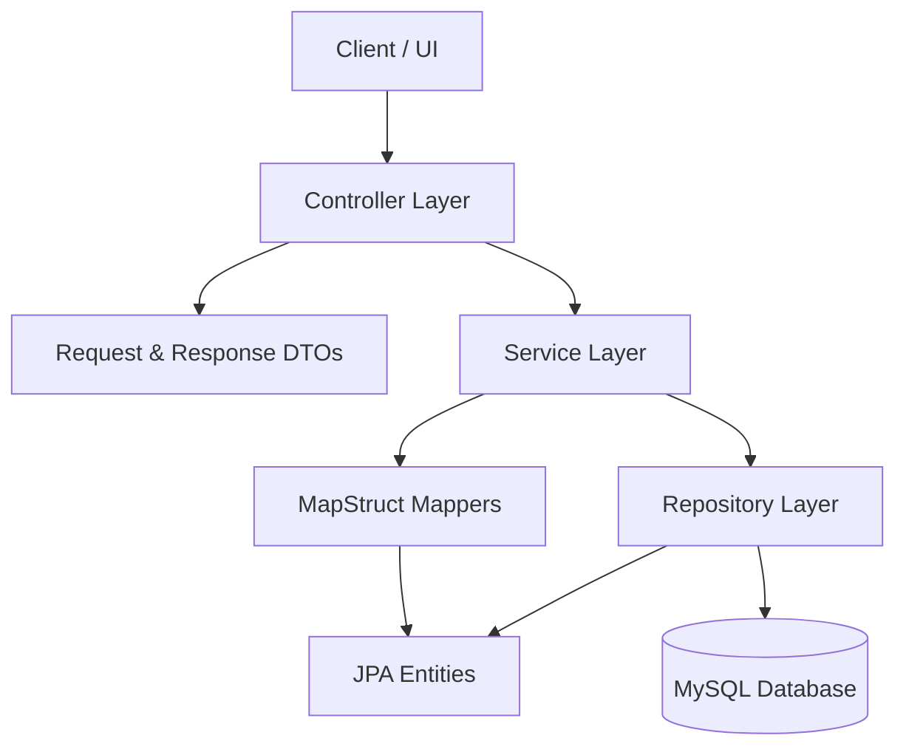
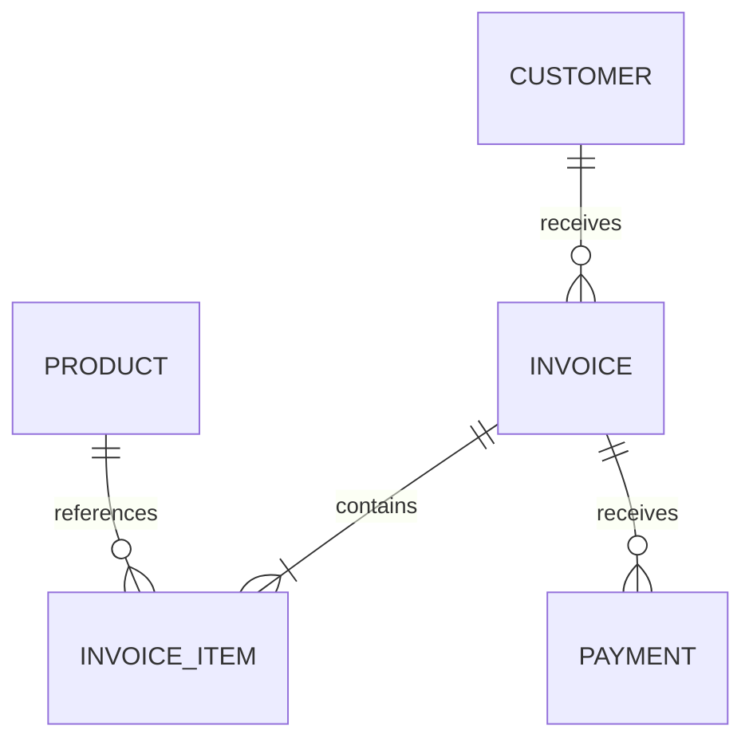

<div align="center">

# 🧾 Invora

### Modern Invoice and Business Management System

Invora is an open-source invoice management backend built with Java and Spring Boot.

[](https://www.oracle.com/java/)
[](https://spring.io/projects/spring-boot)
[](https://mapstruct.org/)
[](https://maven.apache.org/)
[](#-project-status)

</div>

---

## 📖 Table of Contents

- [Overview](#-overview)
- [Why Invora?](#-why-invora)
- [Features](#-features)
- [Project Status](#-project-status)
- [Technology Stack](#-technology-stack)
- [Architecture](#-architecture)
- [Project Structure](#-project-structure)
- [Domain Model](#-domain-model)
- [Getting Started](#-getting-started)
- [Configuration](#-configuration)
- [Building and Testing](#-building-and-testing)
- [Engineering Principles](#-engineering-principles)
- [Git Workflow](#-git-workflow)
- [Contributing](#-contributing)
- [License](#-license)
- [Author](#-author)

## 🌍 Overview

Invora is a Java and Spring Boot application that provides the backend foundation for managing invoices and everyday business records.

It brings customers, products, currencies, invoices, invoice items, payments, company information, users, and audit records into one structured system. Invora applies clear service boundaries, validated DTOs, entity mapping, business-rule enforcement, and consistent API error handling.

The project is designed for:

- Freelancers
- Startups
- Small and medium-sized businesses
- Accountants and bookkeepers
- Developers learning production-focused Spring development

## 💡 Why Invora?

Small businesses need a simple way to manage customers, products, invoices, payments, and outstanding balances. Many existing systems are expensive, difficult to customise, or poorly suited to local business requirements.

Invora provides:

- A free and open-source invoicing foundation
- A maintainable Java backend
- Clear separation between business and persistence logic
- Reliable monetary calculations with `BigDecimal`
- Extensible modules for business and regulatory integrations
- A practical codebase for learning enterprise Spring development

## ✨ Features

### 👥 Customer Management

- Create customer records
- Retrieve customers by ID
- List all customers
- Retrieve active customer summaries
- Update customer information
- Delete customers
- Search customers by name
- Prevent duplicate email addresses and phone numbers

### 📦 Product Management

- Create and update products
- Retrieve individual products
- List products
- Retrieve active product summaries
- Search products
- Filter products by category
- Validate product prices and stock quantities
- Prevent duplicate product names

### 💱 Currency Management

- Create and update currencies
- Retrieve currencies by ID or code
- List supported currencies
- Normalise currency codes
- Configure the default currency
- Prevent multiple default currencies
- Prevent deletion of the default currency
- Prevent inactive currencies from becoming the default

### 🧮 Invoice Calculations

- Calculate invoice-item line totals
- Calculate invoice subtotals
- Apply discounts and taxes
- Calculate invoice totals
- Track amounts paid
- Calculate outstanding balances
- Prevent negative balances
- Prevent discounts from exceeding the subtotal
- Validate quantities and unit prices

### 🧾 Invoice Management

The invoice service defines operations for:

- Creating invoices
- Retrieving invoices by ID or invoice number
- Listing invoices and invoice summaries
- Retrieving invoices by customer
- Updating invoices
- Issuing invoices
- Cancelling invoices
- Deleting invoices

### 💳 Payment Management

- Record payments against invoices
- Retrieve individual payments
- List all payments
- Retrieve payments by invoice
- Update and delete payments
- Validate positive payment amounts
- Recalculate invoice totals after payment deletion

### 🏢 Company Profiles

- Create the active company profile
- Retrieve and update the active company profile
- Prevent multiple active company profiles
- Store company contact information
- Store addresses and tax information
- Store banking details
- Maintain company information used by invoices

### 🛡️ Error Handling

- Custom application exception hierarchy
- Resource-not-found errors
- Duplicate-resource errors
- Invalid-request errors
- Invalid-resource-state errors
- Business-rule errors
- Structured API error responses
- Centralised exception handling

### 📝 Audit Records

- Represent system activity through audit-log entities and response DTOs
- Provide traceability for important business operations

## 🚦 Project Status

Invora is an active backend project. The current codebase contains the domain model, DTOs, repositories, MapStruct mappers, service contracts, exception handling, and service implementations for customers, products, currencies, and invoice calculations.

| Area | Status |
| --- | --- |
| JPA entities | ✅ Implemented |
| Request and response DTOs | ✅ Implemented |
| Spring Data repositories | ✅ Implemented |
| MapStruct mappers | ✅ Implemented |
| Service contracts | ✅ Implemented |
| Customer service | ✅ Implemented |
| Product service | ✅ Implemented |
| Currency service | ✅ Implemented |
| Company profile service | ✅ Implemented |
| Invoice service | ✅ Implemented |
| Invoice calculation service | ✅ Implemented |
| Payment service | ✅ Implemented |
| Global exception handling | ✅ Implemented |
| Remaining service implementations | 🚧 In development |
| REST controllers | 🚧 In development |
| Authentication and authorisation | 🚧 In development |
| API documentation | 🚧 In development |
| PDF and email delivery | 🚧 In development |
| ZIMRA fiscalisation | 🚧 In development |

## 🧰 Technology Stack

| Area | Technology |
| --- | --- |
| Language | Java 21 |
| Framework | Spring Boot 4.1.0 |
| Web | Spring Web MVC |
| Persistence | Spring Data JPA and Hibernate |
| Database driver | MySQL Connector/J |
| Validation | Jakarta Bean Validation |
| Object mapping | MapStruct 1.6.3 |
| Security foundation | Spring Security |
| Server-side templates | Thymeleaf |
| Email foundation | Spring Mail |
| Build tool | Apache Maven |
| Testing | Spring Boot test starters |
| Version control | Git and GitHub |

> The Maven compiler currently targets Java 17 bytecode while the project property specifies Java 21. Use JDK 21 to match the project configuration.

## 🏗️ Architecture

Invora follows a layered architecture:



### Layer Responsibilities

| Layer | Responsibility |
| --- | --- |
| Controller | Receives HTTP requests and returns responses |
| DTO | Defines validated input and safe output models |
| Service | Coordinates use cases and enforces business rules |
| Mapper | Converts between entities and DTOs |
| Repository | Provides database access through Spring Data JPA |
| Entity | Models persisted business data |
| Exception | Produces consistent business and API errors |

## 📁 Project Structure

```text
src/
├── main/
│   ├── java/
│   │   ├── com/ezra_anotida/invoice_maker/
│   │   │   └── exception/       # Exception hierarchy and API error handling
│   │   ├── dto/                 # Request and response records
│   │   ├── entity/              # JPA entities
│   │   ├── enums/               # Domain status values
│   │   ├── mapper/              # MapStruct mappings
│   │   ├── repository/          # Spring Data JPA repositories
│   │   ├── service/             # Service contracts
│   │   └── service/impl/        # Service implementations
│   └── resources/
│       └── application.properties
└── test/
    └── java/                    # Automated tests
```

## 🗃️ Domain Model

| Entity | Responsibility |
| --- | --- |
| `User` | Represents a system user |
| `CompanyProfile` | Stores company, tax, contact, and banking information |
| `Customer` | Stores customer identity and contact information |
| `Product` | Represents a product or service that can be invoiced |
| `Invoice` | Stores invoice dates, totals, status, customer, and payment information |
| `InvoiceItem` | Represents a single invoice line |
| `Payment` | Records money received against an invoice |
| `Currency` | Defines a supported transaction currency |
| `AuditLog` | Records important system activity |

### Entity Relationships



## 🚀 Getting Started

### Prerequisites

Install:

- JDK 21
- Maven 3.9 or newer
- MySQL 8 or newer
- Git

Verify the tools:

```bash
java -version
mvn -version
git --version
```

### Clone the Repository

```bash
git clone https://github.com/ezra-kutsvaira/Invora.git
cd Invora
```

### Create the Database

```sql
CREATE DATABASE invora_db;
```

### Configure the Database

Add the datasource configuration to `src/main/resources/application.properties`:

```properties
spring.application.name=invoice-maker

spring.datasource.url=${DATABASE_URL:jdbc:mysql://localhost:3306/invora_db}
spring.datasource.username=${DATABASE_USERNAME:root}
spring.datasource.password=${DATABASE_PASSWORD}

spring.jpa.hibernate.ddl-auto=update
spring.jpa.open-in-view=false
spring.jpa.show-sql=false
```

Set `DATABASE_PASSWORD` before starting the application. Do not commit real credentials.

### Run Invora

```bash
mvn spring-boot:run
```

## ⚙️ Configuration

The repository currently defines:

```properties
spring.application.name=invoice-maker
```

Database connection settings must be supplied before running against MySQL.

| Variable | Purpose | Example |
| --- | --- | --- |
| `DATABASE_URL` | JDBC connection URL | `jdbc:mysql://localhost:3306/invora_db` |
| `DATABASE_USERNAME` | MySQL username | `root` |
| `DATABASE_PASSWORD` | MySQL password | Set locally |

## 🧪 Building and Testing

### Build

```bash
mvn clean package
```

### Run Tests

```bash
mvn test
```

### Run Verification

```bash
mvn verify
```

### Run the Packaged Application

```bash
java -jar target/invoice-maker-0.0.1-SNAPSHOT.jar
```

## 📐 Engineering Principles

Invora applies:

- SOLID principles
- Separation of concerns
- Constructor-based dependency injection
- Transaction boundaries in the service layer
- DTOs instead of exposing JPA entities
- MapStruct for consistent object mapping
- Jakarta Bean Validation
- Centralised exception handling
- `BigDecimal` for monetary values
- Repository abstractions for persistence
- Helper methods for reusable validation and lookup logic
- Normalisation of business data such as currency codes

## 🌿 Git Workflow

| Branch | Purpose |
| --- | --- |
| `main` | Stable and reviewed code |
| `development` | Integration branch |
| `feature/*` | Feature development |
| `fix/*` | Bug fixes |
| `docs/*` | Documentation changes |

Create a branch from `development`:

```bash
git switch development
git pull origin development
git switch -c feature/your-feature
```

Commit and push:

```bash
git add .
git commit -m "Add your feature"
git push -u origin feature/your-feature
```

Open a pull request into `development`. Changes are reviewed and tested before being merged into `main`.

## 🤝 Contributing

Contributions, suggestions, and bug reports are welcome.

1. Fork the repository.
2. Create a branch from `development`.
3. Make one focused change.
4. Add or update tests.
5. Run `mvn verify`.
6. Commit with a clear message.
7. Push the branch.
8. Open a pull request into `development`.

Before submitting:

- Follow the existing package and naming conventions.
- Keep business logic in the service layer.
- Use DTOs at API boundaries.
- Add validation for new request data.
- Use constructor injection.
- Do not commit credentials or IDE-specific files.
- Update the README when behaviour or setup changes.

## 📄 License

No licence file is currently included in the repository. Add a `LICENSE` file before distributing Invora as an open-source project. The MIT License is a suitable choice for broad reuse and contribution.

## 👨‍💻 Author

**Ezra Kutsvaira**

Java Backend Developer focused on Spring Boot, fintech, and business systems.

- GitHub: [@ezra-kutsvaira](https://github.com/ezra-kutsvaira)

## 🙏 Acknowledgements

Invora uses technologies from:

- [Java](https://www.java.com/)
- [Spring Boot](https://spring.io/projects/spring-boot)
- [Spring Data JPA](https://spring.io/projects/spring-data-jpa)
- [Hibernate ORM](https://hibernate.org/orm/)
- [MapStruct](https://mapstruct.org/)
- [Apache Maven](https://maven.apache.org/)
- [MySQL](https://www.mysql.com/)

---

<div align="center">

### ⭐ Support Invora

If Invora is useful to you, star the repository, report an issue, or contribute an improvement.

</div>
